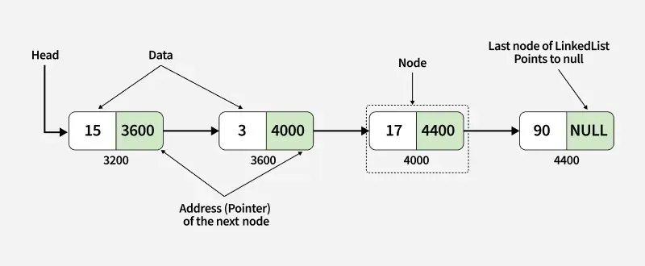

### Data Structures and Algorithms
### Linked List
A linked list is a linear data structure that stores a collection of "nodes" connected by links or pointers, not in a contiguous memory location like an array.

#### Singly Linked List
📖 Introduction
A Singly Linked List (SLL) is a linear data structure consisting of a sequence of nodes.
Each node stores:
- A value
- A pointer/reference to the next node

Code: singly_linked_list.py
Reference: [GeekforGeeks](https://www.geeksforgeeks.org/dsa/linked-list-data-structure/)

---

#### Doubly Linked List
📖 Introduction
A Doubly Linked List (DLL) is a linear data structure consisting of nodes where each node contains:
- Value
- Pointer/reference to the next node
- Pointer/reference to the previous node
- This allows traversal both forward and backward, improving flexibility compared to a singly linked list.

Code: doubly_linked_list.py
Reference: [GeekforGeeks](https://www.geeksforgeeks.org/dsa/linked-list-data-structure/)